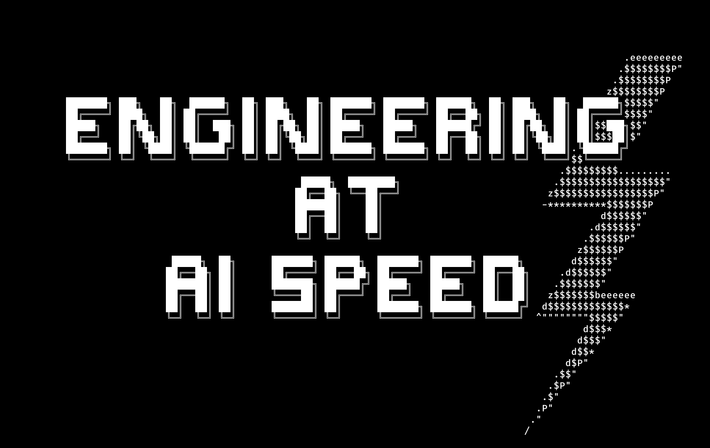

# Engineering at AI Speed



Lessons from the First Agentically Accelerated Software Project

**QCon San Francisco 2025**
[Conference Session](https://qconsf.com/presentation/nov2025/engineering-ai-speed-lessons-first-agentically-accelerated-software-project)

---

## About This Repository

This repository contains the presentation materials and live demos for the talk "Engineering at AI Speed: Lessons from the First Agentically Accelerated Software Project."

The talk draws from our experience building [Claude Code](https://claude.com/claude-code), Anthropic's CLI for AI-assisted development—the first AI coding agent built using itself. **90% of Claude Code's code is written with or by Claude Code**, giving us unique insights into what it means to work at AI speed.

## The Message

> **Implementation is becoming free. Feedback loops are becoming everything.**

The shift isn't that AI writes code faster—it's that you can now optimize for speed of learning rather than quality of judgment.

## Three Stories

The talk explores three real implementations from Claude Code:

1. **Rebuilding Input 🎯** - 333 → 945 lines over 9 months. Custom text input with Unicode handling. Success through testable architecture.

2. **Reimagining Shell 🐚** - Pivoted from persistent to transient shells. Discovered snapshot pattern through experimentation.

3. **Reversing SQLite 🗄️** - 15 days from launch to removal. Learned architectural problems couldn't be predicted from debate.

## Running the Presentation

This presentation uses a custom terminal-based presentation system with live code demos.

```bash
bun install
bun src/presentation.ts
```

### Navigation

- **Arrow Keys (←/→):** Navigate between slides
- **Arrow Keys (↑/↓):** Select interactive links
- **Enter:** Activate links (run demos, open URLs)

### Live Demos

The presentation includes interactive demos that run in tmux:

- `demos/cursor-*.ts` - Text input and Unicode handling
- `demos/shell-*.ts` - Command execution and environment management
- `demos/sqlite-*.ts` - Database complexity and migration issues
- `demos/simple-storage.ts` - The simple JSONL replacement

## Repository Contents

```
content/
├── src/               # Presentation system implementation
├── static/            # Presentation content and ASCII art
│   ├── presentation.md        # Main slide deck
│   ├── presentation-notes.md  # Speaker notes
│   └── *.txt                  # ASCII art assets
├── demos/             # Live code demonstrations
└── docs/              # Technical documentation
    └── markdown.md    # Presentation system docs
```

## The Framework We (Me & 🤖) Built

The presentation itself runs on a custom terminal-based presentation system we built for this talk. It features:

- Markdown-based slide format
- ASCII art rendering
- Live code execution via tmux integration
- Interactive navigation
- asciicinema playback

## Three Questions to Ask

When evaluating any experiment:

1. **What does shipping reveal that planning can not?**
   Domain constraints, user workflows, second-order effects

2. **What architectures enable evolution?**
   Testability, composability, minimal dependencies

3. **What distinguishes detours from dead ends?**
   Does pain decrease or increase with each iteration?

## The Practical Playbook

1. **Ship small, ship often** - Target hours not days
2. **Make reversal cheap** - Feature flags, modular architecture
3. **You have to unship** - Don't rationalize wrong turns, reverse them

## Contact

**Adam Wolff**
Member of Technical Staff, Anthropic

- Twitter/X: [@wolffiex](https://twitter.com/wolffiex)
- GitHub: [wolffiex](https://github.com/wolffiex)
